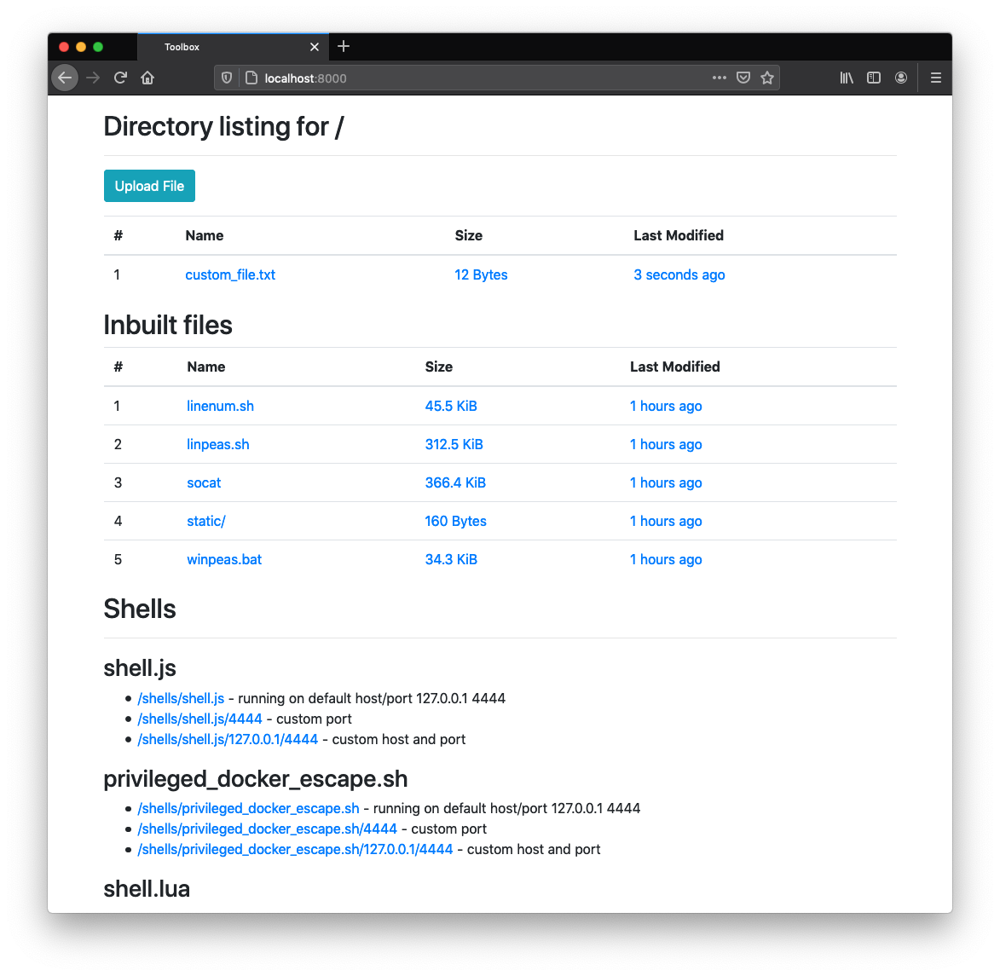

# toolbox

## Installing

```
git clone https://github.com/AlanFoster/toolbox.git
git submodule update
pip3 install -r requirements.txt
python3 toolbox.py --help
```

## Running

### Server

The server will:
- Serve the files within the provided directory
- Serve common CTF tools, such as linpeas.sh and static binaries
- Serve payload/shell generation

Usage:

```
toolbox serve -p 8000 .
```

You can now visit the running server at `http://localhost:8000`



By default the server supports the following files:

- [Payloads](toolbox/server/templates)
- [Common tools](toolbox/config.json)

## Contributing

### Adding additional tools

You can add additional third party projects by creating a new submodule:

```
git submodule add https://github.com/owner/project_name third_party/project_name
```

And updating the associated [configuration file](toolbox/config.json) to include the new tool.

### Running tests

You must first install the developer tools:

```shell
pipenv install --dev
```

Running all tests:

```
pytest
```

To run only one set of tests add the focus marker:

```python
@pytest.mark.focus
def test_some_method():
    assert 1 == 1
```

Run with:

```shell
pytest -m focus
```

Add a debugging breakpoint with:

```python
breakpoint()
```

Updating snapshots:

```shell
pytest --snapshot-update
```

## Planned

- Configure setup.py to install only the required source code + datafiles + licenses
- Use gunicorn / uwsgi in 'production' mode
- Add additional files:
  - static pspy64
